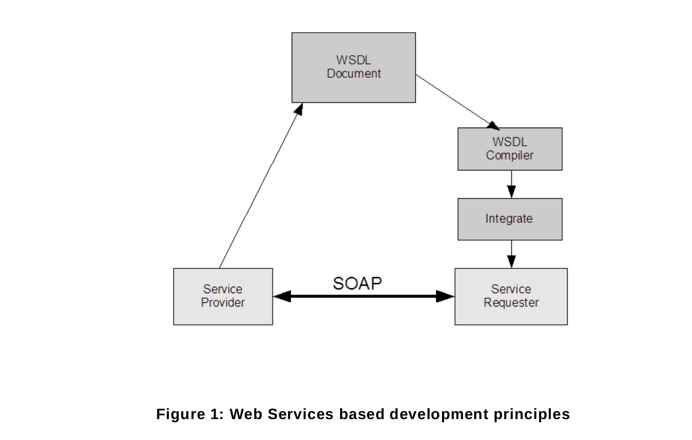

# 4.1 web服务

术语Web服务是一个标准的方法名称,该方法在IP网络上使用开放的,平台无关的Web服务标准来整合应用程序.
包括XML,SOAP 1.2[Part 1]和WSDL1.1.XMl用于描述数据,SOAP用于消息传送,WSDL用于描述服务.

这个框架建立在Web Services标准上.所有定义在标准中的服务配置表现为Web Services操作和定义在HTTP上的WSDL作为传送基础.

图一给了给予Web Services开发的基本原则的概述.服务提供者(设备)实现ONVIF服务.服务使用给予XML的WSDL来描述.然后,
WSDL 作为请求者(客户端)实现和集成的基础.客户端集成可以简单的使用WSDL编译器工具去生成平台相关的代码作为客户端开发者去集成
Web 服务到自己的程序中.

Web服务提供者和请求者使用SOAP消息交换协议通讯.SOAP是一个轻量级的,基于XML的消息协议,用于在网络传送之前编码Web服务请求中的信息和相应消息.
SOAP消息独立于任何操作系统和协议,可以使用多种互联网协议传送.ONVIF标准定义符合使用SOAP消息描述Web服务的传送协议.

Web服务概述章节介绍通用ONVIF服务的结构,规范中的命令定义,错误处理原则和采用的Web服务安全机制.

为保证相互可操作性，所有的ONVIF服务都遵循网络服务互通组织（WS—I）的基本说明2.0建议,并使用document/literal模式.

[上一章](04.00.md)|[继续阅读](04.02.md)
