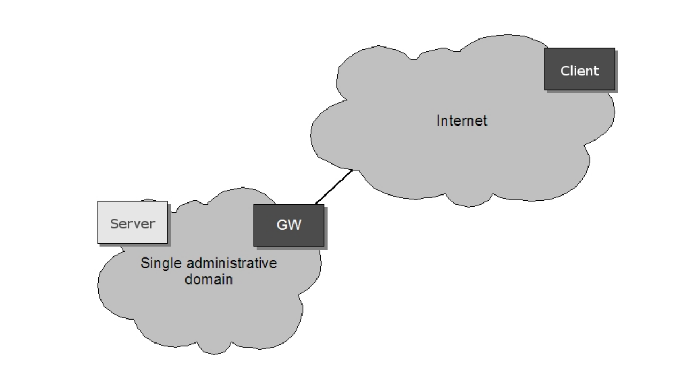
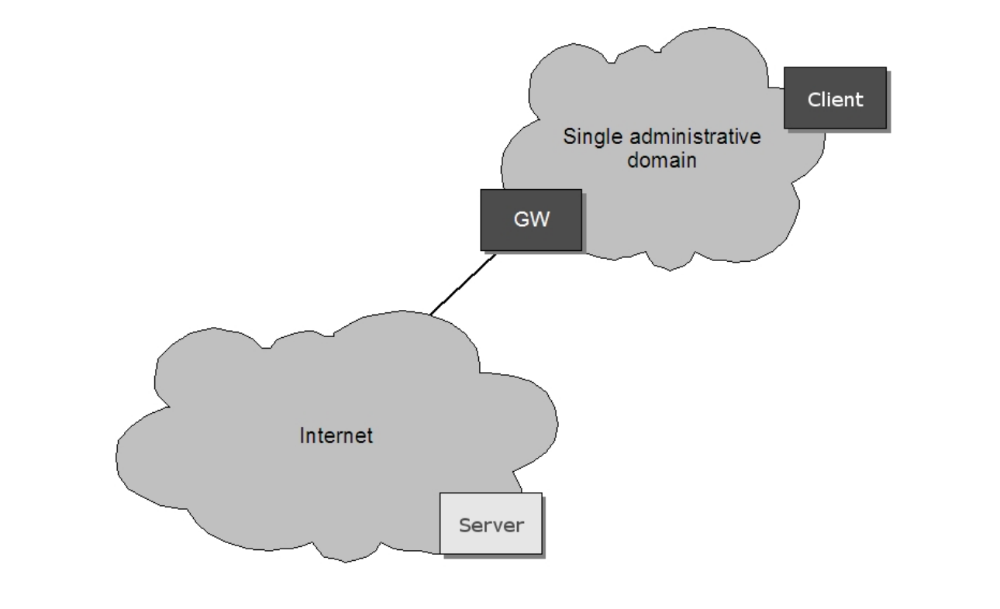
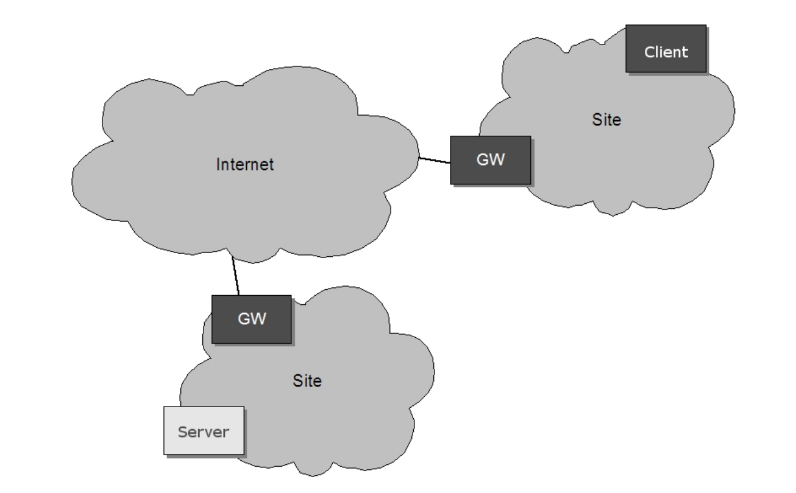

# 7.4.1 网络方案

如果客户端和设备不驻留在同一个管理域，它是没有可能为客户端找到并连接到设备使用多播的探针。例如，如果该设备或客户端驻留在防火墙或NAT（网关GW）在一个网络中，它不能连接到多播的探针。然后，其他的方法需要，本说明书使用了四种不同的情况：

1. 设备驻留在一个管理域（私人）和客户端驻留在公共网络，见图3。
2. 设备驻留在公共网络和客户端驻留在一个管理域（私人），见图4。
3. 设备驻留在一个管理域（私人）和客户端驻留在另一个管理域（私人），见图5。
4. 驻留在公用网络中的设备和客户端，请参阅图6。

!
[WS-Discovery]规范引入了一种发现代理(DP)以解决一些方案。然而 [WS-Discovery]规范没有支持本规范中所引入的所有网络场景。本规范定义了一个DP，使得“即插即用”在我们已经在上面列举过的更复杂的网络方案中可行。这个DP不符合 [WS-Discovery] 规范。

[上一章](07.04.00.md)|[继续阅读](07.04.02.md)
