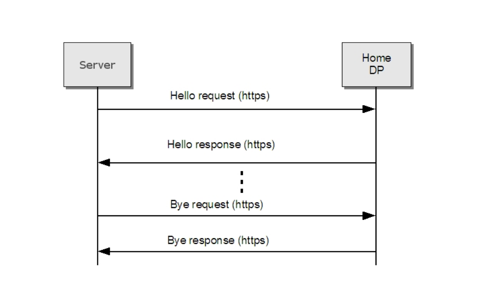

# 7.4.3 远程Hello和探测行为

在[WS-Discovery]中定义的本地发现模式并不适用于远程发现场景。如果该设备驻留在NAT/防火墙后面，类似图3或图5所示，如果设备不返回一个公共网络地址，从DP发出的单播探测将不会自动连接到该设备。此外，如果该设备驻留在防火墙后面，与该设备匹配的单播探测包可能无法回到DP。该规范定义了一个稍微不同的通信模式的远程发现来解决这个问题。

当一个设备配置为远程Hello时，除了当设备加入一个网络或当它的元数据发生变化时需发送一个组播的Hello消息，还要发送远程Hello消息到它的home DP。此消息被当作一个Web Service的请求操作从设备发往DP，如[ONVIF DP WSDL]所定义的那样使用HTTP绑定。远程Hello应该在Hello消息中应包括范围列表。

一旦home DP接收到来自任何设备的一个Hello消息，它将通过一个Hello响应消息来响应确认设备通过Hello消息注册。

同样的，当设备准备离开网络前，它应该先发送一个Bye请求到远程DP。DP通过Bye响应消息来响应已通过Bye请求。

DP Hello，Hello 响应，Bye和Bye响应作为一个DP服务来提供，请参阅[ONVIF DP WSDL]的WSDL定义部分。

使用这些扩展，发现消息可以到达所需的端点。

[上一章](07.04.02.md)|[继续阅读](07.04.04.md)
