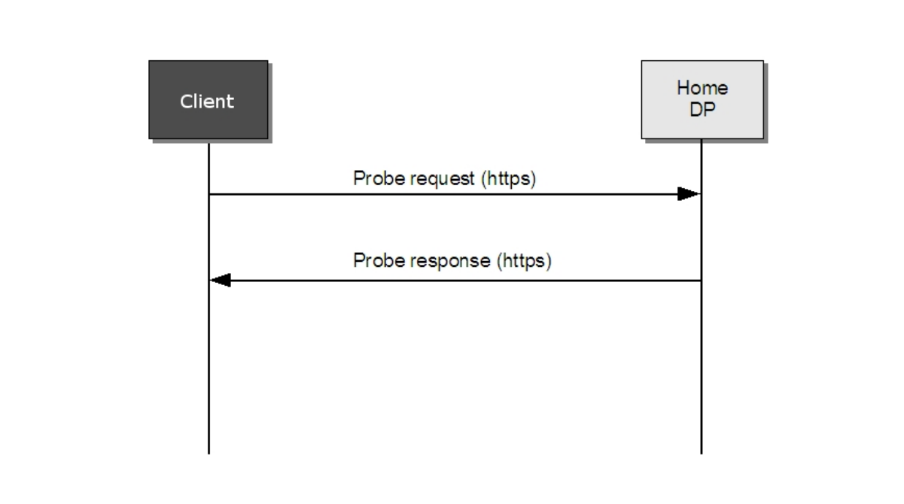

# 7.4.4 客户端行为

在远程发现的情况下，客户端需要发送探测消息到home DP。然后，客户端需要进行配置，这样它就可直接连接到home DP。

当客户端配置为远程发现时，直接发送探测消息到它的home DP。使用HTTP绑定的(见[ONVIF DP WSDL]]探测消息作为一个Web Services的请求操作从客户端发送至DP。

一旦home DP接收到来自任何客户端的探测消息，它根据普通的WS-Discovery消息交换模型，通过相应的探测匹配消息来响应，参见图8的序列图。

[上一章](07.04.03.md)|[继续阅读](07.04.05.md)
