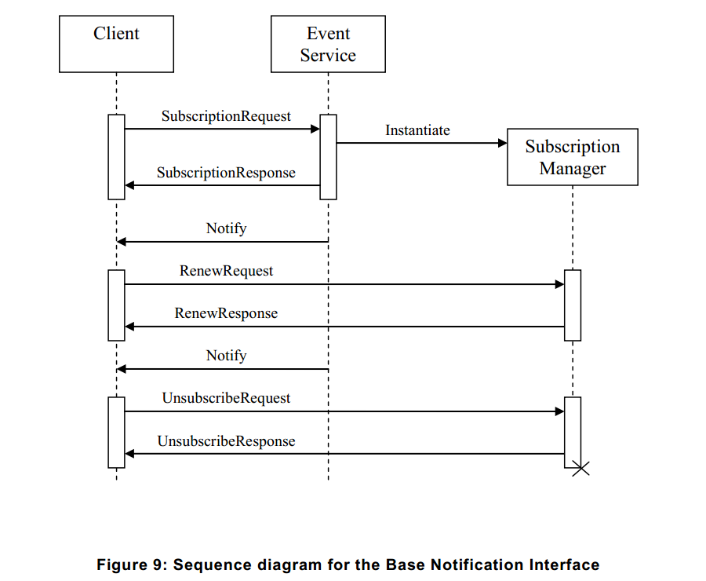

# 9.1.1 引言

下列逻辑实体参与通知模式：
	客户端（Client）：实现NotificationConsumer接口。
	事件服务（Event Service）：实现NotificationProducer接口。
	订阅管理器（Subscription Manager）：实现BaseSubscriptionManager接口。
事件服务和订阅管理器在设备上应该被实例化。

图9中所示的是典型的实体之间交换消息的序列图
首先，客户端建立一个连接到事件服务。然后，客户端可以通过发送SubscriptionRequest订阅一些通知。
如果事件服务接受订阅，它会动态实例化一个SubscriptionManager来表示订阅。
The Event Service shall return the WS-Endpoint-Address of the SubscriptionManager in the SubscriptionResponse.
【事件服务应该返回在SubscriptionResponse中SubscriptionManager的WS端点地址（WS-Endpoint-Address）。】

为了传送与订阅相匹配的通知，另建立一个从事件服务到客户端的连接。
通过此连接，事件服务发送一个单向通知消息到客户端的NotificationConsumer接口。
通过事件服务到客户端可以在任何时间发送相应的通知，而订阅是活跃的。
To control the Subscription, the client directly addresses the SubscriptionManager returned in the SubscriptionResponse.
【若要控制订阅事项，则客户端在SubscriptionResponse中直接返回SubscriptionManager的地址。】
在SubscriptionRequest中，客户端可以指定一个终止时间。当达到终止时间时，自动销毁SubscriptionManager。
客户端可以启动RenewRequests来推迟终止时间。客户端也可以发送一个退订请求（UnsubscribeRequest）来明确终止SubscriptionManager。
退订成功后，SubscriptionManager不再存在。
在[WS-BaseNotification]规范和实现设备中事件服务与SubscriptionManager之间的交互没有进一步指定。

[上一章](09.01.md)|[继续阅读](09.01.02.md)