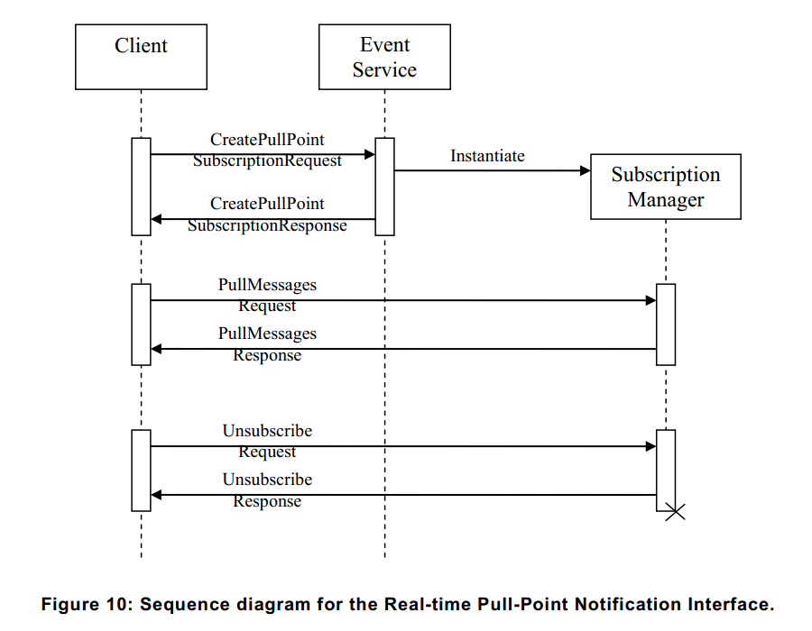

# 9.2 实时拉点(Pull-Point)通知接口

本节介绍实时拉点通知接口。这个接口提供了友好的防火墙通知接口使实时轮询并初始所有客户端的通信。

该接口用于以下列方式：

1、客户端要求为拉点订阅（PullPointSubscription）设备创建拉点订阅请求（CreatePullPointSubscriptionRequest）消息。对比订阅的基本通知接口，ConsumerReference应省略（请参阅第[9.1](09.01)节）。

2、当订阅被接受或一个故障代码时设备评估订阅和返回一个创建拉点订阅响应（CreatePullPointSubscriptionResponse）。

3、如果接受订阅，响应中包含一个WS端点引用（WS-EndpointReference）的SubscriptionManager。WS端点（WS-Endpoint）应提供拉取(PullMessages)消息的操作，这是用来通知客户端检索和[WS-BaseNotification]规范中描述的基本订阅管理接口。基本订阅管理接口由拉取消息（PullMessages）、续订（Renew）和退订（Unsubscribe）操作组成。图10所示的是交互的序列图，提取消息请求（PullMessagesRequest）包含超时和消息限制（MessageLimit）参数。

4、设备应立即响应已经汇总在代表客户端的通知。如果没有汇总的通知，设备会等待响应直到客户端产生通知或超过指定的超时时间。在任何情况下，响应将包含最多由消息限制参数指定的通知数。当每个拉取消息响应（PullMessagesResponse）后开始一个新的拉取消息请求（PullMessagesRequest ）时客户端可以轮询实时通知。

5、在创建拉点订阅请求（CreatePullPointSubscriptionRequest）中如果既没有终止时间也没有一个相对终止时间的设置，那么相对拉点订阅（PullPointSubscription）每个拉取消息请求（PullMessagesRequest）应解释为保持活动。终止时间是根据相对终止时间是否可用或设备内部默认值来重新计算的。要通知客户端更新后的终止时间，拉取消息响应（PullMessagesReponse）应包含当前时间（currentTime）和终止时间（TerminationTime）元素。当把拉取消息请求（PullMessagesRequest）作为保持活动的相应拉点订阅（PullPointSubscription），该续订请求由[WS-BaseNotification]定义，不需要由客户端。尽管如此，该设备应支持拉点订阅（PullPointSubscription）。

6、如果设备支持持久通知存储，请查看第[9.9](09.09.md)节，WS端点（WS-Endpoint）应提供一个寻求（Seek）操作。此操作允许拉取指针（pull pointer）重新定位到过去。在拉取指针定位超出了一开始的缓冲区的情况下，第一次调用拉取消息（PullMessages）将启动第[9.12.9](09.12.9.md)节定义的开始缓冲事件（BeginOfBuffer）。寻求请求（SeekRequest）包含一个UTC时间参数。UTC时间参数应针对通知消息（NotificationMessage）上的UTC时间属性相匹配。当寻求（Seek）用于拉取指针时应定位于UTC时间属性小于或等于寻求参数（Seek argument）的缓冲区中所包含的通知消息（NotificationMessages）。寻求请求（SeekRequest）还包含一个可选的反向参数可用来反向提取拉取消息请求（PullMessageRequest）。为了允许精确的事件产生和（或）多个客户端，设备应支持多个拉点。如果一台设备一次只支持一个订阅，客户端很可能需要没有范围限制的订阅，因为改变订阅事件是不可能的。这就需要设备服务于所有可用的事件，其中设备将激活所有的子系统产生的事件。这可能会导致不必要的负载，例如激活多个移动侦测器和类似的不需要的事件。此外，所有这些事件所产生的流量可能会导致大量的网络负载。通常情况下，网络设备并行服务于多个客户端。通常每个客户端必须订阅他们感兴趣的一些事件。

[上一章](09.01.02.md)|[继续阅读](09.02.01.md)